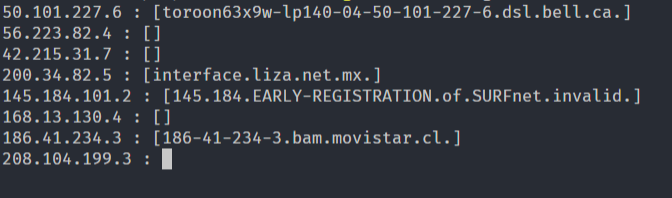

# randomdns [](https://travis-ci.org/thc2cat/randomdns)
`randomdns` is a cli wich purpose generate random dns queries (DNS testing)

## Quickstart

Download a release and run it.



### Prerequisites

`randomdns` is written in golang, so building will requisite you to install golang.


### Installing

```
 go get github.com/thc2cat/randomdns
 go build 
 go install
```

## Contributing

Please read, fork and PR (no, i'm just kidding)

## Authors

* **thc2cat** - *Initial work* 

## License (later)

This project is licensed under the ?? License - see the [LICENSE.md](LICENSE.md) file for details

## Acknowledgments

* Hat tip to anyone who's code was used
* Inspiration
* etc
